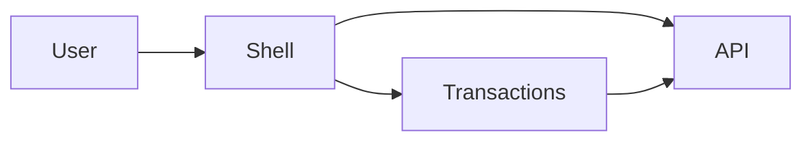

# Finance App

> Tech Challenge - Pós Tech Front-End Engineering (FIAP)

## Sobre o projeto

O Finance App é uma aplicação para gerenciamento financeiro desenvolvida como evolução da primeira fase do Tech Challenge.

O objetivo desta etapa foi evoluir a arquitetura da aplicação, adicionar novos recursos e aplicar conceitos vistos durante a pós-graduação, como microfrontends, gerenciamento de estado, SSR, Docker e deploy em cloud.

Mais do que adicionar funcionalidades, a preocupação durante o desenvolvimento foi manter uma arquitetura organizada, reduzir duplicação de código e facilitar futuras evoluções do projeto.

---

## Links

### Aplicação

- Shell (Dashboard): https://tech-challenge-shell.vercel.app/dashboard
- Transactions: https://tech-challenge-transactions.vercel.app/transactions

### API

- Railway: https://techchallenge-production-0516.up.railway.app

### Repositório

https://github.com/MateusReinert/TechChallenge

---

## Stack

- Next.js 16
- React 19
- TypeScript
- Material UI
- Redux Toolkit
- Storybook
- Recharts
- Docker
- Docker Compose
- Railway
- Vercel
- JSON Server
- npm Workspaces

---

## Arquitetura

O projeto foi organizado como um monorepo utilizando npm Workspaces.

```text
finance-app
├── apps
│   ├── shell
│   └── transactions
├── packages
│   ├── ui
│   └── shared
```

### Shell

Responsável pelo Dashboard, layout principal e integração entre as aplicações.

### Transactions

Contém toda a funcionalidade de gerenciamento das transações.

### @finance/ui

Durante o desenvolvimento vários componentes passaram a ser utilizados pelas duas aplicações. Em vez de duplicar código, eles foram movidos para este package juntamente com o Design System.

### @finance/shared

Contém regras de negócio compartilhadas, tipos e utilitários que não dependem de React ou Next.js.

---

## Microfrontends

Foi utilizada a estratégia **Next.js Multi Zones**.

O desafio sugere Module Federation ou Single SPA. Como ambas as aplicações utilizam Next.js 16 com App Router, a escolha pelo Multi Zones permitiu manter SSR, Server Components e deploy independente sem adicionar uma camada extra de complexidade.

Cada aplicação possui:

- build independente;
- deploy independente;
- dependências próprias;
- ciclo de desenvolvimento próprio.

A comunicação acontece através da API compartilhada e do roteamento entre as zonas.



---

## Funcionalidades

- Dashboard financeiro
- Cards de resumo
- Gráficos
- Insights financeiros
- CRUD completo
- Busca
- Filtros avançados
- Paginação
- Ordenação
- Upload de comprovantes
- Sugestão automática de categoria
- Sidebar recolhível
- Responsividade
- Feedback visual

---

## Redux

Cada microfrontend possui sua própria Store Redux.

Essa decisão evita acoplamento entre aplicações e permite que cada uma evolua de forma independente.

---

## SSR e Server Actions

O carregamento inicial utiliza Server Components.

As operações de criação, edição e exclusão utilizam Server Actions para centralizar a comunicação com a API.

---

## Responsividade

Durante os testes foram feitos ajustes para notebooks, monitores Full HD e dispositivos móveis.

Alguns cuidados adotados:

- filtros reorganizados automaticamente;
- cards adaptáveis;
- gráficos responsivos;
- Sidebar recolhível;
- painel de detalhes adaptável;
- tabela com scroll interno.

---

## Acessibilidade

Foram implementadas práticas como:

- navegação por teclado;
- aria-label;
- aria-current;
- foco visível;
- contraste adequado;
- estrutura semântica.

---

## Docker

O projeto possui três imagens:

- Shell
- Transactions
- API

```bash
docker compose up --build
```

---

## Deploy

O projeto foi publicado utilizando:

- Vercel para os microfrontends;
- Railway para a API.

Essa separação permite que frontend e backend sejam publicados de forma independente.

---

## Decisões arquiteturais

Algumas decisões tomadas durante o desenvolvimento:

- utilização de monorepo para facilitar compartilhamento de código;
- criação do package `@finance/ui` para concentrar componentes reutilizáveis;
- criação do package `@finance/shared` para regras compartilhadas;
- filtros sincronizados com a URL;
- Stores Redux independentes;
- utilização de Multi Zones;
- Design Tokens centralizados.

---

## Requisitos atendidos

| Requisito             | Implementação |
| --------------------- | ------------- |
| Dashboard             | ✔             |
| Gráficos              | ✔             |
| CRUD                  | ✔             |
| Busca                 | ✔             |
| Filtros               | ✔             |
| Paginação             | ✔             |
| Upload                | ✔             |
| Sugestão de categoria | ✔             |
| Docker                | ✔             |
| Docker Compose        | ✔             |
| Cloud                 | ✔             |
| Microfrontends        | ✔             |
| Redux                 | ✔             |
| TypeScript            | ✔             |
| SSR                   | ✔             |
| Acessibilidade        | ✔             |

---

## Como executar

```bash
npm install

npm run dev:api
npm run dev:transactions
npm run dev:shell
```

Ou:

```bash
docker compose up --build
```

---

## Considerações finais

Durante o desenvolvimento, a prioridade foi construir uma aplicação organizada e de fácil manutenção, evitando duplicação de código e separando responsabilidades entre os módulos.

Algumas escolhas foram feitas pensando na stack utilizada. Por isso foi adotado Next.js Multi Zones como estratégia de microfrontend, mantendo a arquitetura compatível com App Router e SSR sem perder a independência entre as aplicações.

O resultado é uma aplicação composta por dois microfrontends independentes, compartilhando componentes e regras através de packages comuns, com deploy separado, Docker, documentação e arquitetura preparada para futuras evoluções.

---

## Autor

Mateus Reinert

Pós Tech Front-End Engineering - FIAP
